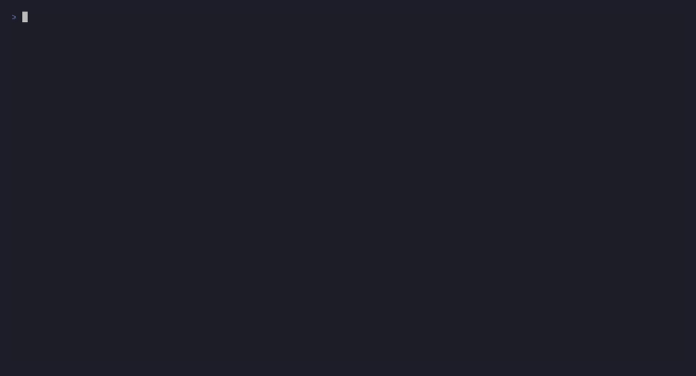

# veriseal

A CLI that takes a robot/autonomy log (MCAP) and produces a **tamper-evident, independently-verifiable incident package** — so a disinterested party can later prove "this log has not been altered since it was sealed, here is exactly what the machine decided in the incident window."



---

## Install

```bash
pip install veriseal
```

Or from source:

```bash
git clone https://github.com/kylemaps/veriseal.git
cd veriseal
pip install -e .
```

---

## Quickstart

```bash
# Seal a log (generates a fresh key; submits Merkle root to OpenTimestamps by default)
veriseal seal log.mcap --out log.seal.json

# Seal without OpenTimestamps — fast, fully offline
veriseal seal log.mcap --no-anchor --out log.seal.json

# Verify integrity
veriseal verify log.mcap log.seal.json
# → INTACT — signature valid, 200 messages, root 3f8a2b1c...

# Tamper detection — flip one byte in a copy and re-verify
python -c "
d = bytearray(open('log.mcap', 'rb').read())
d[1024] ^= 0xFF
open('tampered.mcap', 'wb').write(bytes(d))
"
veriseal verify tampered.mcap log.seal.json
# → TAMPERED
#   Merkle root mismatch
#   MODIFIED  topic='/pose' log_time=1750032001000000000

# Inspect an incident time-window (ISO-8601 or nanoseconds since epoch)
veriseal inspect log.mcap \
    --from 2025-06-16T00:00:01Z \
    --to   2025-06-16T00:00:04Z \
    --topic /pose

# Export window as a new MCAP (openable in Foxglove Studio)
veriseal inspect log.mcap \
    --from 2025-06-16T00:00:01Z \
    --to   2025-06-16T00:00:04Z \
    --out  incident.mcap
```

### OpenTimestamps anchor

By default, `veriseal seal` submits the signed Merkle root to public Bitcoin calendar servers ([OpenTimestamps](https://opentimestamps.org)). The embedded proof starts as `status: "pending"` and becomes `"confirmed"` once a Bitcoin block includes the Merkle path (~1 hour later).

`veriseal verify` reports anchor status **informationally** — the INTACT/TAMPERED verdict and exit code are unaffected by anchor state:

```
INTACT — signature valid, 200 messages, root 3f8a2b1c...
  Anchor: pending (not yet Bitcoin-confirmed)
```

Skip anchoring for offline workflows or CI:

```bash
veriseal seal log.mcap --no-anchor
```

---

## Threat model

**What it PROVES:** the log has not been altered since it was sealed; the seal was made by a specific key at a specific time; the time is independently anchored (not "trust my clock"). It lets a third party detect and locate tampering.

**What it does NOT prove:** that the log is a truthful record of physical reality at capture time. A seal cannot un-fabricate data captured falsely. Integrity ≠ veracity.

**Where neutrality actually comes from:** sealing as early as possible (ideally at/near capture) and anchoring the root in a public append-only log, so no single party (including the custodian) can backdate or alter it. The closer the seal is to capture and the more public the anchor, the more "neutral" the evidence.

> **Content vs bytes:** `verify` checks message **content**, not file bytes — a losslessly re-muxed MCAP with identical messages still verifies INTACT. `source.sha256` is the separate strict byte-level check, reported alongside the Merkle result.

---

## How it works

1. **Hash** — each MCAP message is domain-separated and SHA-256 hashed: `SHA-256(b"\x00" + b"veriseal-leaf-v1\x00" + len(topic) + topic + log_time + payload)`.
2. **Merkle tree** — leaves sorted by `(log_time, topic, leaf_hash)` and combined with the [RFC 6962](https://www.rfc-editor.org/rfc/rfc6962) binary Merkle Tree Hash algorithm. Any single-byte change flips the root; the leaf diff pinpoints the exact message.
3. **Sign** — the manifest (root + all leaves + metadata) is serialized as canonical JSON and signed with Ed25519. The signer's public key is embedded in the manifest.
4. **Anchor** — the signed manifest is SHA-256 hashed and submitted to [OpenTimestamps](https://opentimestamps.org) public calendars. A Bitcoin block later commits to it, providing a trustless timestamp no single party (including the sealer) can backdate.

The `.seal.json` format is fully documented in **[SPEC-manifest.md](SPEC-manifest.md)** — a conforming verifier needs only that document, the MCAP, and standard crypto libraries.

---

## Architecture

```
seal     ingest MCAP → hash every message → RFC 6962 Merkle tree →
         sign manifest (Ed25519) → anchor root (OpenTimestamps/Bitcoin) → *.seal.json

verify   recompute Merkle tree from MCAP → check signature → compare roots →
         INTACT or TAMPERED (locate modified/added/removed messages)
         informational: anchor status (pending / confirmed / invalid)

inspect  filter MCAP to time window → print chronological event timeline →
         export window as incident.mcap (openable in Foxglove Studio)
```

---

## Running the demo

```bash
cd demo
python make_sample.py          # generates sample.mcap (synthetic AV log, ~200 msgs)
bash demo.sh                   # seal → verify INTACT → tamper → verify TAMPERED → inspect
```

To record `demo.gif` using [VHS](https://github.com/charmbracelet/vhs):

```bash
vhs demo/demo.tape
```

---

## Roadmap

- **v0.1:** seal / verify / inspect on MCAP + OpenTimestamps anchor
- **v0.2:** chain-of-custody log; RFC 3161 + Sigstore/Rekor option; ROS 2 bag ingest; HTML report
- **v0.3:** web viewer; sealing daemon; pluggable transparency-log backend

---

## License

Apache-2.0 © Kyle Mapue
